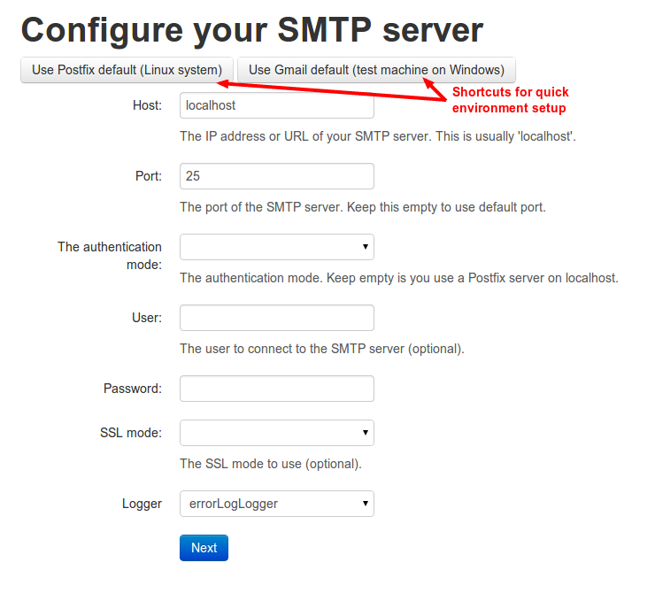

The SwiftMailService
===================

The `SwiftMailService` is a wrapper of the Swift library for the Mouf PHP framework.
It is used to send mails using a SMTP mail server.

The `SwiftMailService` is designed to be simple to use. Behind the scene, the <code>SwiftMailService</code>
is using the more complex (and more powerful) Swift Mailer mail service.

Install
-------
This package is part of the [Mouf PHP framework](http://mouf-php.com). As such, it comes with a nice graphical installer.



You can configure the settings to connect to your SMTP server.

There is one compulsory parameter: <b>host</b>, which is the address of the server.

By default, on Linux systems, it is likely you will use the local mail server (host=127.0.0.1). You will have a "sendmail" or "postfix" server installed
on your machine.
If you are performing your developments on a Windows machine, it is quite likely that you will not have an SMTP server on your machine. You will 
therefore have to use a remote server. To access the remote server, you will certainly have to use login/passwords, etc...

When this package is installed, it will create 2 instances:

- a `swiftMailService` that implements Mouf's `MailServiceInterface`
- a `swiftMailer` that is the classic Swift mailer.

<div class="alert alert-info">Note: nothing prevents you from creating several instances of the SwiftMailService class
with different parameters (in the rare case you have an application that needs to connect to several SMTP servers).</div>

After installation, you will see that a number of constants have been added to your `config.php` file.
When deploying on other servers, you can of course change those constants to adapt to the settings of the server.

What? 2 instances?
------------------

There are both a `swiftMailService` and a `swiftMailer`. Which should you use?

Well it depends...

- `swiftMailService` implements Mouf's `MailServiceInterface`. This is a simple interface to create mails easily.
  Use it if you have simple needs. If you use this instance, you will be able to easily replace your Swift mailer
  with any other mailer compatible with the `MailServiceInterface`, like the `SmtpMailService` (that uses
  ZendMail as a backend), or the DBMailService (that stores mails in database instead of sending them).
  
- `swiftMailer` is great if you want a greater control over your mails, or if you are already used to using
  Swift directly. It is also greatly documented over the web.

Tip: using your gmail account to send mails
-------------------------------------------

In a development environment, it can be useful to use you gmail account. Here are the settings:

- host =&gt; 'smtp.gmail.com'
- ssl =&gt; 'tls'
- port =&gt; 587
- auth =&gt; 'login'
- username => <em>Your gmail mail address</em>
- password => <em>Your password</em>

Example use
-----------

Below is a sample code you can use to send a mail.

```php
use Mouf\Utils\Mailer\Mail;
use Mouf\Utils\Mailer\SwiftMailService;

// First, let's create the mail object
$mail = new Mail();
$mail->setTitle("My mail");
$mail->setBodyText("This is my mail!");
$mail->setBodyHtml("This is my &lt;b&gt;mail&lt;/b&gt;!");
$mail->setFrom(new MailAddress("my@server.com", "Server"));
$mail->addToRecipient(new MailAddress("david@email.com", "David"));

// Let's get the instance of the service
$mailService = Mouf::getSwiftMailService();

// Finally, we send the mail
$mailService->send($mail);
```

Sending a mail with an attachment
---------------------------------

```php
use Mouf\Utils\Mailer\Mail;
use Mouf\Utils\Mailer\SwiftMailService;

// The mail object
$mail = new Mail();
$mail->setTitle("My mail");
$mail->setBodyHtml("A nice image: ");
$mail->setFrom(new MailAddress("my@server.com", "Server"));
$mail->addToRecipient(new MailAddress("david@email.com", "David"));

// The attachment
$attachment = new MailAttachment();
$attachment->setFileContent(file_get_contents('attachment.pdf'));
$attachment->setMimeType('application/pdf');
$mail->addAttachement($attachment);

// Let's get the instance of the service
$mailService = Mouf::getSwiftMailService();

// Finally, we send the mail
$mailService->send($mail);
```

Sending a mail with embedded image
----------------------------------

```php
use Mouf\Utils\Mailer\Mail;
use Mouf\Utils\Mailer\SwiftMailService;

// The image we will embed:
$embeddedImage = new MailAttachment();
$embeddedImage->setFileContent(file_get_contents('img.png'));
$embeddedImage->setMimeType('image/png');
$embeddedImage->setAttachmentDisposition('inline');
// Note: the format of the ID should be in the syntax of a mail: xxx@yyy.zzz
$embeddedImage->setContentId('my@img.resource');

// The mail object
$mail = new Mail();
$mail->addAttachement($embeddedImage);
$mail->setTitle("My mail");
$mail->setBodyHtml("A nice image: ");
$mail->setFrom(new MailAddress("my@server.com", "Server"));
$mail->addToRecipient(new MailAddress("david@email.com", "David"));

// Let's get the instance of the service
$mailService = Mouf::getSwiftMailService();

// Finally, we send the mail
$mailService->send($mail);
```

To learn more about how to send mails, refer to the [Introduction to Mouf's mail architecture](http://mouf-php.com/packages/mouf/utils.mailer.mail-interface/README.md).
